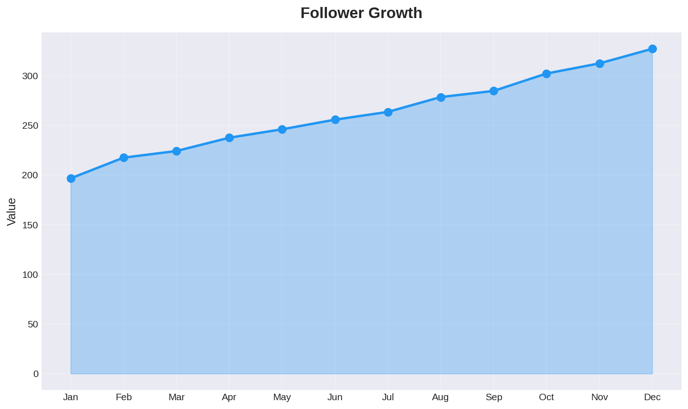
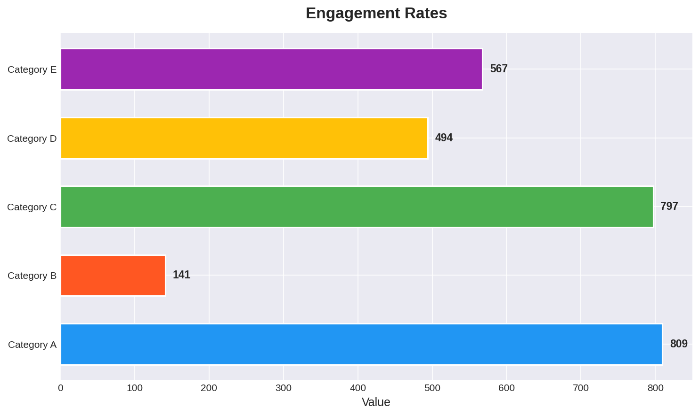
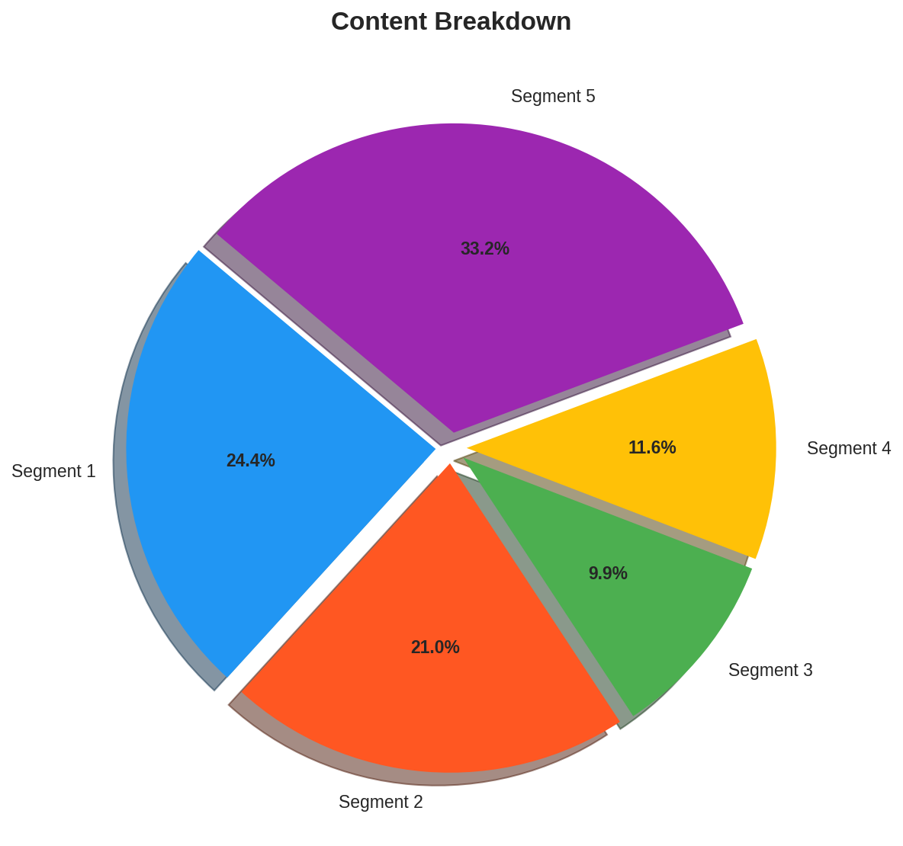
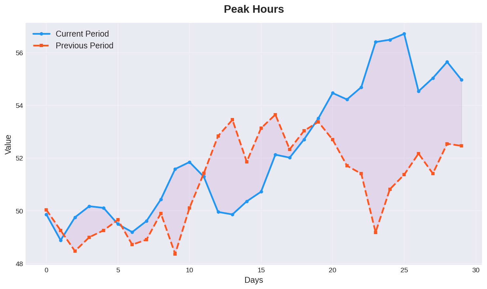

# Social Media Analytics Dashboard

This is a production-ready Python dashboard project for social media analytics. It uses Streamlit as the main framework and provides a clean layout with sidebar navigation and multiple pages.

## Features

* Overview page with a table of the latest data
* Follower Growth page with a line chart of follower growth over time
* Engagement Rates page with a bar chart of engagement rates over time
* Content Breakdown page with a pie chart of content types
* Peak Hours page with a bar chart of engagement rates by hour

## Screenshots

## Requirements

* Python 3.8+
* Streamlit 1.19.0
* Pandas 1.4.2
* Plotly 5.10.0
* Matplotlib 3.5.1
* NumPy 1.22.3

## Installation

1. Clone the repository
2. Install the requirements with `pip install -r requirements.txt`
3. Run the dashboard with `streamlit run app.py`

## Usage

1. Run the dashboard with `streamlit run app.py`
2. Navigate to the different pages using the sidebar
3. View the charts and tables on each page
---
Last updated: v6.8.9
